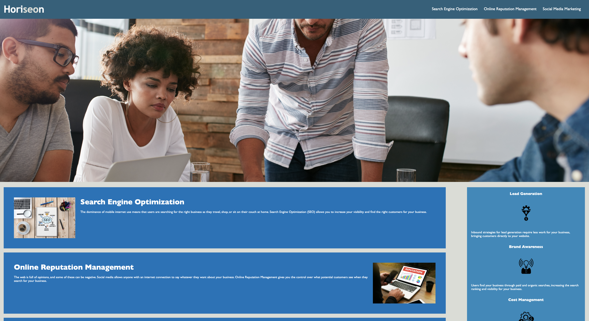

# Refactoring
<!-- PROJECT LOGO -->
 

  

<!-- TABLE OF CONTENTS -->

  
Table of Contents

    <ol>
        <li>
            <a href="#about-the-project">About The Project</a>
            <ul>
            <li><a href="#refactored-with">Refactored With</a></li>
        </ul>
        </li>
        <li><a href="#license">License</a></li>
        <li><a href="#contact">Contact</a></li>
        <li><a href="#acknowledgements">Acknowledgements</a></li>
    </ol>

<!-- ABOUT THE PROJECT -->
## About The Project

The purpose of this project was to refactor the .html and .css files to make them more accessible and semantic. After going over and reading the code carefully, it was my job to change the "div" tags to more semantic tags, such as, "header", "body", "footer", "section", and "article" tags. I also had to simplify the ".css" stylesheet so we didn't have repeated code. There was a broken link at the top that I aslo fixed. Why is all this important?

Here's why:
* Semantic coding is an important practice because it gives character to your code and provides of the details that normally wouldn't be provided. The webpage now being accessible, now allows screen-readers to properly function on this site!
* Simplifying the stylesheet was an important task because it helps clean up the .css file and and provides an easier read for anyone going over my code.
* I noticed one of the links weren't working so I went ahead and fixed it. Even though my job was to refactor, it is imoprtant to pay attention and fix small errors, such as those!

There was much more to the refactorong project but these were my main focal point and objectives/accomplishments with this assignment!

### Refactored With

When refactoring this assignment, I used Visual Studio Code to code the .html and .css files
* [VS Code](https://code.visualstudio.com/)

<!-- LICENSE -->
## License

Distributed under the MIT License. See `LICENSE` for more information.

<!-- CONTACT -->
## Contact

Sami Khawja - Skhawja11@gmail.com

Project Link: [https://github.com/samikhawja/first-assignment](https://github.com/samikhawja/first-assignment)

Live Link: [https://samikhawja.github.io/first-assignment/](https://samikhawja.github.io/first-assignment/)

<!-- ACKNOWLEDGEMENTS -->
## Acknowledgements
* Taylor Hackbart